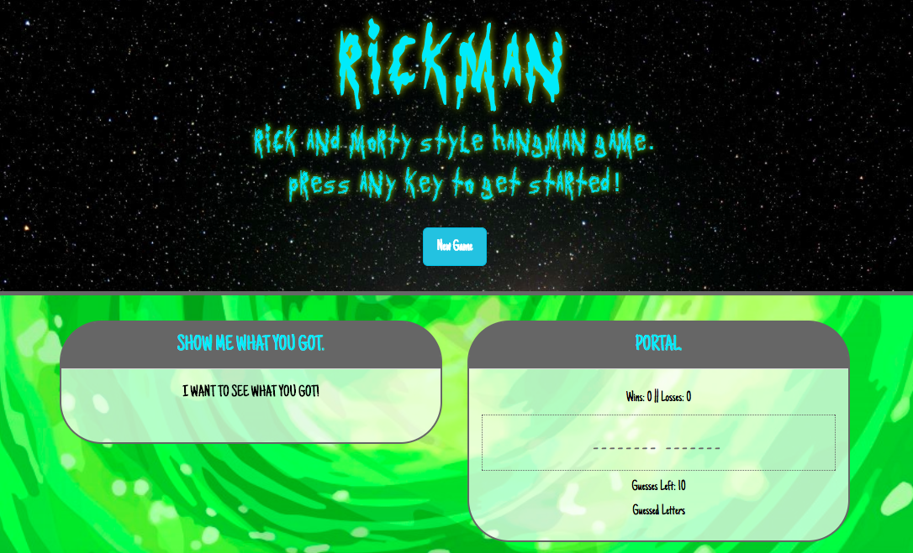

# Rickman
A `Rick and Morty` themed Hangman Game built with HTML5, CSS3, and Javascript.

**Live Demo**: https://rickman.herokuapp.com/



Table of Contents
-------

- [Getting Started](#getting-started)
- [Technologies](#technologies)
- [Project Structure](#project-structure)
- [Support](#support)
- [Contributing](#contributing)
- [License](#license)

Getting Started
---------------

The easiest way to get started is to clone the repository:

```bash
# Get the latest snapshot
git clone --depth=1 https://github.com/wrainaud/Rickman.git myproject

# Change directory
cd myproject

# Create Config file to hook into Firebase
touch config.js 
```
Technologies
-------

- HTML5
- CSS3
    - Bootstrap
- Javascript


Project Structure
-------
```
|-- assets/
|  |-- css/
|     |-- style.css                     // Main Game CSS Styles
|  |-- images/                             
|  |-- js/                             
|     |-- javascript.js                // Main Game Logic
| 
| -- index.html                     // Main HTML page with structure
```

Support
-------

Please [open an issue](https://github.com/wrainaud/Rickman/issues/new) for support.

Contributing
-------

Please contribute using [Github Flow](https://guides.github.com/introduction/flow/). Create a branch, add commits, and [open a pull request](https://github.com/wrainaud/Rickman/compare/).

License
-------

The MIT License (MIT)

Copyright (c) 2017-2018 William J. Rainaud

Permission is hereby granted, free of charge, to any person obtaining a copy of this software and associated documentation files (the "Software"), to deal in the Software without restriction, including without limitation the rights to use, copy, modify, merge, publish, distribute, sublicense, and/or sell copies of the Software, and to permit persons to whom the Software is furnished to do so, subject to the following conditions:

The above copyright notice and this permission notice shall be included in all copies or substantial portions of the Software.

THE SOFTWARE IS PROVIDED "AS IS", WITHOUT WARRANTY OF ANY KIND, EXPRESS OR IMPLIED, INCLUDING BUT NOT LIMITED TO THE WARRANTIES OF MERCHANTABILITY, FITNESS FOR A PARTICULAR PURPOSE AND NONINFRINGEMENT. IN NO EVENT SHALL THE AUTHORS OR COPYRIGHT HOLDERS BE LIABLE FOR ANY CLAIM, DAMAGES OR OTHER LIABILITY, WHETHER IN AN ACTION OF CONTRACT, TORT OR OTHERWISE, ARISING FROM, OUT OF OR IN CONNECTION WITH THE SOFTWARE OR THE USE OR OTHER DEALINGS IN THE SOFTWARE.  
